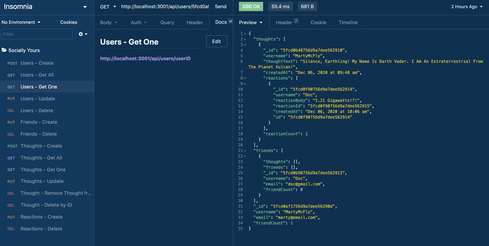

# Socially Yours

## Description
Socially Yours is a social network api. This api gives the user the opportunity to join as a user, express a thought, have other users friend them and react to their thoughts.

***
## Table of Contents
[Installation](#installation) 
[Usage](#usage) 
[Contributing](#contributing) 
[Tests](#tests) 
[License](#license) 
[Questions](#questions) 
***
## Installation
Socially Yours requires node js, express and mongoose. Run npm install from the command line and then run npm start to start the server.

## Usage
Socially Yours can be used to create a social media network where users create thoughts, have friends follow and react to their thoughts. All CRUD functionality exists where a user can be created, updated and deleted and all users can be viewed as a group or by id. A friend can be added or removed from the user. User's thoughts can be created, read, updated and deleted. Friends can react to users thoughts by adding a reaction or a reaction can be delted.

## Contributing

## Tests

## License
### This license is covered under the GNU license(s):
* The GNU General Public License (GNU GPL or simply GPL) is a series of widely-used free software licenses that guarantee end users the freedom to run, study, share, and modify the software.
***
## Questions
For more information contact me at: 
* Name: aksmith5239
* GitHub: https://github.com/aksmith5239/socially
* Email Address: aklobby@gmail.com
    